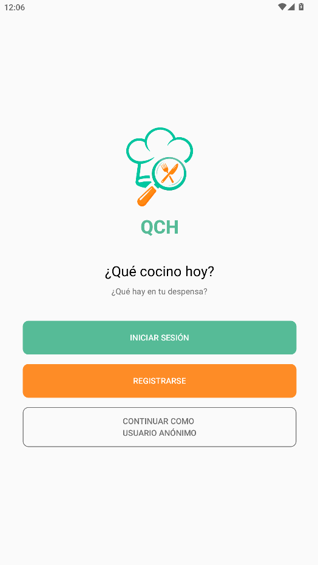
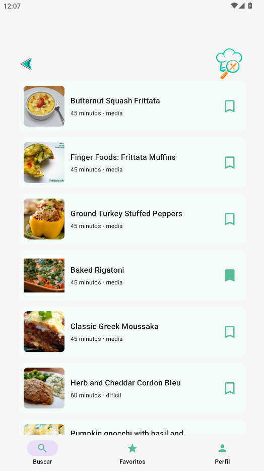
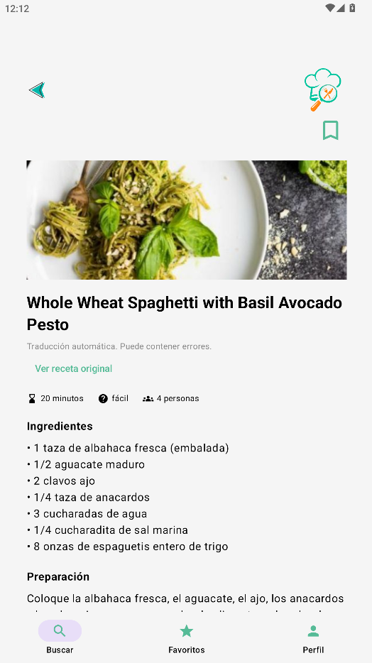
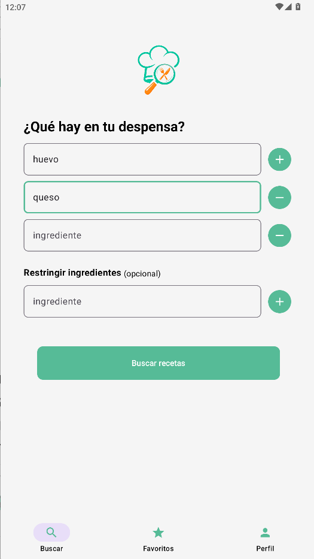

# 🍳 ¿Qué Cocino Hoy? (QCH)

Aplicación Android desarrollada en Kotlin (AndroidStudio) que ayuda a encontrar recetas a partir de los ingredientes disponibles.

El objetivo de QCH es facilitar la planificación diaria de comidas, permitiendo descubrir nuevas recetas y salir de la rutina culinaria utilizando los ingredientes que el usuario indique (y eliminando aquellos que restrinja).

---

## Características principales

- Registro e inicio de sesión mediante Firebase Authentication.
- Acceso como usuario invitado.
- Búsqueda de recetas por ingredientes.
- Exclusión de ingredientes no deseados.
- Visualización detallada de recetas.
- Traducción automática al español mediante Google ML Kit.
- Guardado de recetas favoritas.
- Sincronización de favoritos entre dispositivos mediante Firestore.
- Gestión de perfil de usuario.

---

## Tecnologías utilizadas

- Kotlin
- Android Studio
- Jetpack Compose
- Firebase Authentication
- Firebase Firestore
- Spoonacular API
- Google ML Kit Translation
- Retrofit
- Coil

---

## 📸 Capturas de pantalla

### Pantalla principal

### Resultados de búsqueda

### Detalle de receta

### Búsqueda

---

## Sitio web

https://qch-app-9f234.web.app/

---

## Descarga APK

[Descargar APK]([https://qch-app-9f234.web.app/](https://github.com/MabadC/QCH/releases/download/v1.0/QCH.apk)

---

## Autor

Proyecto desarrollado por:

**Mireya Abad**

Proyecto Final de CFGS Desarrollo de Aplicaciones Multiplataforma (DAM)

Curso 2025-2026
